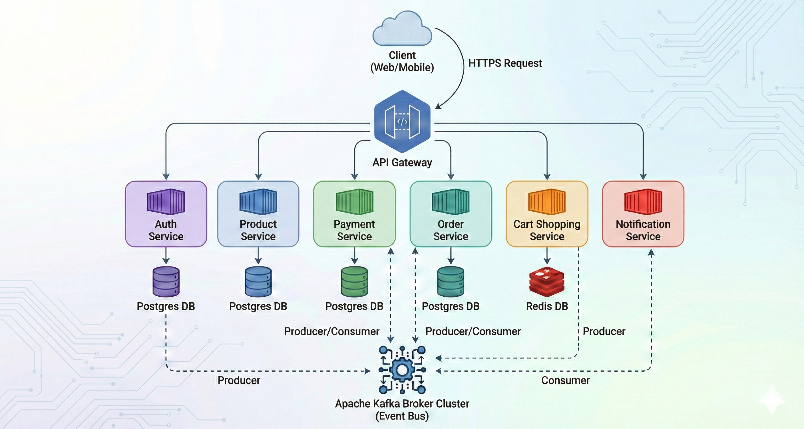

#  E-commerce Microservices System


Sistema robusto de microsserviços para e-commerce, desenvolvido com foco em escalabilidade, segurança e alta performance. O projeto orquestra serviços independentes para gestão de catálogo, autenticação segura, carrinho de compras de alta velocidade e processamento assíncrono de pagamentos.

---

##  Arquitetura e Design

O sistema utiliza uma arquitetura baseada em microsserviços orquestrados por containers, seguindo o padrão MVC internamente em cada serviço. A comunicação ocorre via APIs REST (síncrona) utilizando **Feign Client** e via mensageria (assíncrona) com **Apache Kafka**.

### Diagrama de Arquitetura



###  Tecnologias e Ferramentas

• Core: Java 17, Spring Boot 3.5.7

• Arquitetura: Microservices, MVC, API Gateway

• Banco de Dados: * PostgreSQL: Para dados relacionais (Usuários, Produtos, Pagamentos).

• Redis: Para dados voláteis e de acesso rápido (Carrinho de Compras).

• Mensageria: Apache Kafka (Processamento de eventos de pagamento).

• Segurança: Spring Security, OAuth2, JWT (JSON Web Token).

• Comunicação: Spring Cloud OpenFeign, Spring WebFlux.

• DevOps: Docker, Docker Compose.

• Utilitários: Lombok, MapStruct, Bean Validation, JPA.


---

# Services

### API Gateway

O API Gateway atua como a porta de entrada única para o ecossistema de microsserviços. Ele é responsável pelo roteamento de requisições, agregação de documentação (Swagger) e, crucialmente, pela camada de segurança e validação de tokens JWT antes que as requisições cheguem aos serviços de domínio.

### Tecnologias

•  Java 17

• Spring Boot 3.x

• Spring Cloud Gateway: Para roteamento dinâmico e filtros.

• Spring WebFlux: Stack reativa para alta performance.

• SpringDoc OpenAPI: Para agregação da documentação dos microsserviços.

• Docker & Docker Compose: Orquestração de containers.


#### Segurança e Autenticação

A segurança é gerenciada centralmente através de um filtro customizado: JwtValidationGatewayFilterFactory. Este componente intercepta todas as requisições para rotas protegidas.

#### Fluxo de Validação

1. Verificação de Whitelist: O gateway verifica se o endpoint acessado está na lista de rotas públicas (openApiEndPoints), como login e registro.

2. Verificação de Cabeçalho: Se a rota for privada, verifica a existência do header Authorization e o prefixo Bearer.

3. Validação Remota: O gateway realiza uma chamada assíncrona (via WebClient) para o Auth Service no endpoint /api/auth/validate

•  Se válido: A requisição segue para o microsserviço de destino.
•  Se inválido/erro: Retorna 401 Unauthorized imediatamente, protegendo os serviços internos.

#### Documentação Centralizada(Swagger)

O API Gateway agrega as especificações OpenAPI (v3) de todos os microsserviços em uma única interface visual.

• Acesso: Acesse /swagger (ou /webjars/swagger-ui/index.html) no navegador.

• Funcionamento: O Gateway reescreve as rotas (RewritePath) para buscar o JSON v3/api-docs de cada serviço individualmente e os apresenta no dropdown do Swagger UI.

#### Serviços Documentados:

1. Auth Service

2. Product Catalog Service

3. Cart Shopping Service

4. Payment Service

5. Order Service

#### Como Executar

Pré-requisitos:

• Docker e Docker Compose instalados.

Serviço de Autenticação (auth-service) deve estar rodando para que a validação de token funcione.

```

# Criar rede (se não existir)
docker network create internal

# Subir aplicação
docker-compose up --build -d

```

---

### Auth Service

Responsável pela gestão de identidade, emissão de tokens JWT (JSON Web Tokens) e ciclo de vida dos usuários. Este serviço segue uma arquitetura orientada a eventos para desacoplar ações críticas (como envio de e-mails) do fluxo principal de autenticação.

#### Arquitetura e Fluxo de Dados

Serviço com persistência de dados em PostgreSQL e também com producer de eventos para o ecossistema via Kafka, garantino que o tempo de resposta do usuário não seja afetado pelo envio de e-mails.


### Funcionalidades Principais

•  Autenticação JWT: Emissão e validação de tokens seguros.

•  Registro Seguro: Criptografia de senha usando BCrypt antes da persistência.

•  Verificação de Conta: Sistema de tokens temporários para validação de e-mail.

•  Recuperação de Senha: Fluxo completo de "Esqueci minha senha" com tokens de expiração curta (30 minutos).

•  Gestão de Usuários: Listagem paginada, busca por nome e ativação/desativação administrativa.

#### Eventos e Integração

Este serviço utiliza o padrão Observer/Publisher (ApplicationEventPublisher) para notificar outros componentes do sistema.

1. CreateAccountValidationEvent: Disparado ao registrar. Contém o link de verificação.

2. ResetPasswordEvent: Disparado ao solicitar troca de senha. Contém o token de reset.

Nota: Estes eventos são convertidos em mensagens (Kafka/RabbitMQ) para que o Notification Service processe o envio real dos e-mails.

#### Tecnologias Utilizadas

• Java 17 Spring Boot 3

• Spring Security: Framework de segurança.

• JPA / Hibernate: ORM para interação com banco de dados.

• PostgreSQL 16: Banco de dados relacional.

• Lombok: Redução de boilerplate code.

• Docker: Containerização.

#### Configuração e Execução

Variáveis de Ambiente (.env)

O serviço depende das seguintes variáveis para funcionar corretamente via Docker Compose:

Variável,Descrição,Exemplo

 ```

SPRING_USER = <nome_do_usuario_igual_do_banco>
SPRING_PASSWORD = <senha_do_usuario_igual_do_banco>

POSTGRES_USER = <nome_usuario_do_banco>
POSTGRES_PASSWORD = <senha_do_banco>
POSTGRES_DB = <nome_do_banco>
JWT_SECRET = <chave_secreta_256bit>

```
#### Executando com Docker

O serviço roda na porta 4005 e possui dependência direta do container postgres_auth.

```

docker-compose up --build -d

```

---

### Product Catalog Service

Responsável pela gestão centralizada do catálogo de produtos, organização de categorias e controle de disponibilidade de estoque. Este serviço atua como a fonte da verdade para dados de produtos e garante a integridade do estoque durante o ciclo de vida dos pedidos.

### Funcionalidades Principais

#### Gestão de Produtos e Estoque

• CRUD de Produtos: Criação e edição com validação de unicidade de SKU

• Inicialização de Inventário: Criação automática de registro de estoque ao cadastrar um novo produto.

• Reserva e Débito: Lógica transacional para verificação e baixa de estoque.

• Rollback de Estoque: Mecanismo de compensação para devolver itens ao estoque disponível em caso de falhas externas.

• Consultas Otimizadas: Listagem paginada e busca textual por Nome ou SKU

#### Gestão de Categorias

• Organização Taxonômica: Criação e manutenção de categorias para agrupamento de produtos.

• Validação de Slug: Garantia de URLs amigáveis e únicas através da verificação de slugs.

• Associação: Vínculo de múltiplas categorias a um único produto.

#### Tecnologias Utilizadas

• Java 17 Spring Boot 3.

• JPA / Hibernate: ORM para interação com banco de dados.

• PostgreSQL 16: Banco de dados relacional.

• Lombok: Redução de boilerplate code.

• MapStruct: Mapeamento eficiente entre DTOs e Entidades.

• Docker: Containerização.

#### Configuração e Execução

Variáveis de Ambiente (.env)

O serviço depende das seguintes variáveis para funcionar corretamente via Docker Compose:

Variável,Descrição,Exemplo

 ```

SPRING_USER = <nome_do_usuario_igual_do_banco>
SPRING_PASSWORD = <senha_do_usuario_igual_do_banco>

POSTGRES_USER = <nome_usuario_do_banco>
POSTGRES_PASSWORD = <senha_do_banco>
POSTGRES_DB = <nome_do_banco>
JWT_SECRET = <chave_secreta_256bit>

```
#### Executando com Docker

```

docker-compose up --build -d

```

---

### Shopping Cart Service

Responsável pelo gerenciamento temporário da intenção de compra do usuário. Este serviço prioriza a baixa latência utilizando armazenamento em memória (Redis) validando a disponibilidade de estoque em tempo real antes de iniciar o processo de checkout.


#### Arquitetura e Fluxo de Dados

O serviço opera com persistência volátil (Redis) para garantir rapidez nas operações de escrita e leitura do carrinho. Comunica-se de forma síncrona com o Product Catalog Service para validações de estoque e dispara eventos assíncronos para iniciar o fluxo de pedidos.

### Funcionalidades Principais

#### Gerenciamento de Carrinho (Redis)

• Adição de Itens: Inserção de produtos vinculados ao userId extraído do token JWT.

• Atualização de Quantidade: Incremento ou decremento de itens com recálculo automático do valor total.

• Persistência Rápida: Utiliza Redis (Key-Value Store) para armazenar o estado do carrinho, evitando carga desnecessária no banco relacional.

#### Validação e Integração

• Checagem de Estoque (Síncrono): Utiliza OpenFeign para consultar o Product Catalog Service, impedindo a adição de itens com quantidade superior ao estoque disponível.

• Segurança: Extração automática de claims do JWT (userId, userName) para garantir que o usuário manipule apenas seu próprio carrinho.

#### Checkout e Processamento

• Geração de ID de Pedido: Utiliza TSID (Time-Sorted Unique Identifier) para gerar identificadores de pedidos performáticos e ordenáveis.

• Disparo de Evento: Ao finalizar o carrinho, publica o evento CheckOutCreatedEvent, limpando o carrinho no Redis e enviando os dados para processamento no Kafka.

#### Eventos e Integração

1. ProductCatalogClient (Feign): Valida a existência do SKU e a quantidade em estoque (Request/Response).

2. CheckOutCreatedEvent (Kafka): Evento disparado contendo o payload do pedido para ser consumido pelo Order Service.

#### Tecnologias Utilizadas

• Java 17 & Spring Boot 3

• Spring Data Redis: Persistência em memória de alta performance.

• Spring Cloud OpenFeign: Cliente HTTP declarativo para comunicação entre microsserviços.

• Apache Kafka: Producer de mensagens para o fluxo de checkout.

• TSID: Geração de IDs únicos distribuídos.

• Docker: Containerização. 


#### Configuração e Execução

Variáveis de Ambiente (.env)

O serviço depende das seguintes variáveis para funcionar corretamente via Docker Compose:

Variável,Descrição,Exemplo

 ```

JWT_SECRET_KEY = <chave_secreta_256bit>

```
#### Executando com Docker

```

docker-compose up --build -d

```

---

### Order Service

Responsável pelo ciclo de vida completo dos pedidos, desde a materialização do checkout até a entrega. Este serviço atua como um hub centralizador, transformando a intenção de compra

#### Arquitetura e Fluxo de Dados

O serviço adota uma arquitetura híbrida:

1. Assíncrona (Kafka): Para alta vazão na criação de pedidos e processamento de confirmações de pagamento.

2. Síncrona (Feign): Para garantir a integridade do inventário no momento exato da criação do pedido.

#### Funcionalidades Principais

• Criação via Evento: Consome o tópico checkout-create para gerar novos pedidos com status inicial PENDING.

• Reserva de Estoque (Síncrono): Durante a criação, comunica-se diretamente com o Product Catalog Service para debitar a quantidade de itens. Se o estoque falhar, o pedido não é processado.

• Persistência Relacional: Salva os detalhes do pedido e itens em banco de dados PostgreSQL.

#### Gestão de Pagamentos e Estados

• Consome o tópico payment-success. Ao receber a confirmação, atualiza o status para PAID e registra a data/hora da transação.

• Controla as transições de status (ex: impede alteração de pedidos CANCELLED) e publica eventos de mudança para notificar o cliente.

#### Notificações e Integração

• PaymentSuccessEvent: Disparado após confirmação do pagamento para envio de Email

• OrderChangeEvent: Disparado a cada mudança de status manual ou automática (para atualização de tracking).

#### Eventos e Integração

O serviço interage intensamente com o ecossistema:

1. Inputs (Kafka Consumers):

• checkout-create: Payload vindo do Shopping Cart Service.

• payment-success: Payload vindo do Payment Gateway/Service.


2. Outputs (Kafka Producers):

• OrderChangeEvent: Notifica o Notification Service sobre o andamento do pedido.

3. Dependência Direta (Feign):

• ProductCatalogClient: Realiza o débito físico do inventário .


#### Tecnologias Utilizadas

• Java 17 & Spring Boot 3

• Spring Cloud OpenFeign: Comunicação HTTP síncrona.

• Spring Kafka: Consumo e produção de mensagens.

• PostgreSQL 16: Banco de dados relacional para persistência de pedidos.

• Docker: Containerização. 

#### Configuração e Execução

Variáveis de Ambiente (.env)

O serviço depende das seguintes variáveis para funcionar corretamente via Docker Compose:

Variável,Descrição,Exemplo

 ```

SPRING_USER = <nome_do_usuario_igual_do_banco>
SPRING_PASSWORD = <senha_do_usuario_igual_do_banco>

POSTGRES_USER = <nome_usuario_do_banco>
POSTGRES_PASSWORD = <senha_do_banco>
POSTGRES_DB = <nome_do_banco>

```
#### Executando com Docker

```

docker-compose up --build -d

```

---

### Payment Service

Responsável pelo processamento financeiro das transações do e-commerce. Este serviço atua como um intermediário seguro entre a plataforma e o gateway de pagamento (Stripe), garantindo a conciliação financeira e a atualização dos pedidos.

#### Arquitetura e Fluxo de Dados

1. Assíncrona (Kafka): Para a ingestão inicial de pedidos gerados pelo checkout, garantindo desacoplamento do Order Service

2. Híbrida (Stripe API + Webhooks):

• Síncrona: Criação da intenção de pagamento (PaymentIntent) junto ao Stripe.

• Assíncrona: Confirmação final do status (Aprovado/Rejeitado) via Webhook seguro, garantindo que o status local reflita a realidade bancária.

#### Funcionalidades Principais

• Ingestão de Pedidos: Consome o tópico checkout-create. Ao receber um pedido, persiste os dados financeiros no banco local com status inicial PENDING, sem cobrar o cliente imediatamente.

• Processamento de Pagamento (Stripe):

 • Verifica se o cliente possui método de pagamento (cartão) salvo no Stripe.

 • Gera um PaymentIntent com metadados do pedido (itens, IDs, usuário) para rastreabilidade no painel do Stripe.

 • Executa a tentativa de cobrança (confirm).

• Webhook Seguro: Endpoint dedicado para receber callbacks do Stripe.
  
 • Valida a assinatura digital (Stripe-Signature) para evitar fraudes.

 • Trata eventos de sucesso (payment_intent.succeeded) e falha (payment_intent.payment_failed)

• Consulta e Histórico: Permite a busca paginada de pagamentos realizados.

#### Tecnologias Utilizadas

• Java 17 & Spring Boot 3

• Stripe Java SDK: Para comunicação com a API de pagamentos.

• Spring Kafka: Consumo e produção de mensagens.

• PostgreSQL 16: Banco de dados relacional para persistência de pedidos.

• Docker: Containerização.


#### Configuração e Execução


Pré-requisitos do Stripe (Ambiente de Desenvolvimento)

Para que o processamento de pagamentos e a confirmação via Webhook funcionem localmente, é necessário configurar o ambiente de Sandbox do Stripe e utilizar o CLI para tunelamento.

#### 1. Criação de Conta e Chaves
 
1. Crie uma conta gratuita no 

2. No menu lateral, ative a opção "Test Mode" (Modo de Teste).

3. Vá em Developers > API Keys.

4. Copie a Secret Key (inicia com sk_test_...) e adicione ao seu arquivo .env na variável STRIPE_API_KEY.

#### 2. Configurando o Webhook Local (Stripe CLI)

O Stripe não consegue enviar requisições HTTP para o seu localhost diretamente. Para testar o fluxo completo (aprovação/rejeição), você deve usar o Stripe CLI.

1. Instale o Stripe CLI:

• 

2. Autentique o CLI: Execute no terminal:

```

stripe login

```

3. Inicie o Listener (Tunelamento): O comando abaixo cria um túnel para redirecionar os eventos do Stripe para a sua aplicação rodando na porta 4007.

Nota: Verifique no seu PaymentController qual é a rota exata que chama o método webhook. Abaixo assumimos /api/payment/webhook.

```

stripe listen --forward-to localhost:4007/api/payment/webhook

```

4. Obtenha o Segredo do Webhook: Assim que o comando acima iniciar, ele exibirá uma mensagem como:

Ready! Your webhook signing secret is whsec_...

Copie este código (inicia com whsec_) e adicione ao seu arquivo .env na variável WEBHOOK_SECRET_KEY.

#### Como Testar o Fluxo

Com o stripe listen rodando em um terminal separado:

1. Faça uma requisição de checkout (via Order Service).

2. O PaymentConsumerService criará o pagamento no Stripe.

3. Você verá eventos aparecendo no terminal do Stripe CLI (payment_intent.created, etc.).

4. Para simular um pagamento com sucesso, use os  (ex: 4242 4242...)

Variáveis de Ambiente (.env)

O serviço depende das seguintes variáveis para funcionar corretamente via Docker Compose:

Variável,Descrição,Exemplo

 ```

SPRING_USER = <nome_do_usuario_igual_do_banco>
SPRING_PASSWORD = <senha_do_usuario_igual_do_banco>

POSTGRES_USER = <nome_usuario_do_banco>
POSTGRES_PASSWORD = <senha_do_banco>
POSTGRES_DB = <nome_do_banco>

WEBHOOK_SECRET_KEY = <senha_do_webhook>

STRIPE_API_KEY= = <senha_stipe_api>

```
#### Executando com Docker

```

docker-compose up --build -d

```

---

### Notification Service

Responsável por centralizar toda a comunicação transacional da plataforma. Este serviço atua como a "voz" do ecossistema, escutando eventos de negócio (pagamentos, pedidos, segurança) e transformando-os em e-mails formatados e personalizados para o usuário final.

#### Arquitetura e Fluxo de Dados

O serviço segue uma arquitetura puramente Event-Driven (Orientada a Eventos), garantindo que o envio de e-mails não bloqueie os fluxos críticos de compra ou autenticação.

1. Consumo Assíncrono (Kafka): O serviço não possui APIs REST de entrada. Ele reage passivamente a mensagens publicadas por outros microsserviços.

2. Renderização de Templates (Thymeleaf): Utiliza motor de templates para gerar HTMLs dinâmicos, injetando dados do evento (nome, valor, itens) em layouts de e-mail profissionais.

3. Delivery (Mailtrap): Delega o envio real para o provedor Mailtrap, ideal para ambientes de desenvolvimento e teste (Sandbox de e-mail).

#### Funcionalidades Principais

O serviço gerencia quatro tipos principais de comunicação:

• Recibo de Pagamento (Payment Success):

  • Gera um comprovante detalhado com lista de itens, método de pagamento (cartão/pix), últimos 4 dígitos e data da transação.

• Acompanhamento de Pedido (Order Tracking):
 
 • Notifica o usuário a cada mudança de status (ex: PENDING -> PAID -> SHIPPED), mantendo o cliente informado sobre a entrega.

• Boas-vindas e Validação (Account Validation): 

 • Envia links de confirmação de cadastro para novos usuários.

• Segurança (Password Reset):

 •  Envia tokens seguros para redefinição de senha quando solicitado pelo Identity Service.


#### Tecnologias Utilizadas

• Java 17 & Spring Boot 3

• Spring Kafka: Para orquestração das mensagens.

• Spring Kafka: Consumo e produção de mensagens.

• Thymeleaf: Motor de templates server-side para gerar o HTML dos e-mails.

• Mailtrap Java Client: SDK oficial para integração com o serviço de e-mail.

• Docker: Containerização.

#### Configuração do Mailtrap (Obrigatório)

Este serviço utiliza o Mailtrap para simular o envio de e-mails sem precisar de um servidor SMTP real. Para que o serviço inicie sem erros, você precisa de uma API Key.

1. Crie uma conta em .

2. No painel, navegue até Sending > Domains (ou use a Sandbox se preferir testes de captura).

3. Vá em Settings > API Tokens.

4. Gere um novo token com permissão de envio.

5. Adicione este token ao seu arquivo .env ou variáveis de ambiente.

Variáveis de Ambiente (.env)

O serviço depende das seguintes variáveis para funcionar corretamente via Docker Compose:

Variável,Descrição,Exemplo

 ```

MAILTRAP_KEY= = <senha_mailtrap_key>

```
#### Executando com Docker

```

docker-compose up --build -d

```

---

## Infraestrutura Core & Observabilidade

Este módulo é responsável por sustentar a comunicação assíncrona entre os microsserviços e prover visibilidade sobre a saúde do sistema.

#### 1. Apache Kafka (Modo KRaft)

Utilizamos a versão mais moderna do Kafka, configurada no modo KRaft (Kafka Raft Metadata mode), eliminando a dependência do Zookeeper. Isso simplifica a arquitetura e reduz o consumo de recursos.

#### Destaques da Configuração:

• Roles Híbridas: O nó atua simultaneamente como broker e controller.

• Dual Listeners (Rede): Configuração crucial para funcionamento híbrido (Docker e Host):

 • INTERNAL (Porta 19092): Usada exclusivamente para comunicação entre os containers (microsserviços conversando com o Kafka). 

 • CLIENT (Porta 9092): Exposta para a máquina host. Permite que você rode aplicações ou ferramentas de depuração fora do Docker conectando-se ao localhost:9092.

 • Auto-Create Topics: Habilitado para facilitar o desenvolvimento (KAFKA_AUTO_CREATE_TOPICS_ENABLE=true). Tópicos são criados automaticamente ao serem acessados pela primeira vez.

 #### 2. Kafka UI

 Interface gráfica para gerenciamento do cluster Kafka.

  • Permite visualizar tópicos, partições, offsets e mensagens em tempo real.

  • Configurada para se conectar automaticamente ao cluster interno via kafka:19092. 

#### 3. Pilha de Observabilidade (Prometheus & Grafana)

Monitoramento centralizado para coletar métricas de performance da JVM, do Spring Boot e do próprio Kafka.

• Prometheus: Banco de dados de séries temporais. Ele "raspa" (scrapes) as métricas expostas pelos microsserviços (via endpoint /actuator/prometheus).

• Requer o arquivo de configuração prometheus.yml na raiz para definir os alvos (targets).

• Grafana: Plataforma de visualização. Conecta-se ao Prometheus para gerar dashboards gráficos sobre latência, requisições por segundo e erros.

## Acesso aos Serviços de Infraestrutura

Após subir o ambiente com docker-compose up, as seguintes ferramentas estarão disponíveis:

### 🚀 Serviços Disponíveis

| Serviço | URL de Acesso | Credenciais | Descrição |
| :--- | :--- | :--- | :--- |
| **Kafka (Host)** | `localhost:9092` | *N/A* | Endereço para conectar consumers/producers na IDE. |
| **Kafka UI** | [http://localhost:8090](http://localhost:8090) | *N/A* | Dashboard visual do Kafka. |
| **Prometheus** | [http://localhost:9090](http://localhost:9090) | *N/A* | Consulta crua de métricas (PromQL). |
| **Grafana** | [http://localhost:3000](http://localhost:3000) | `admin` / `admin` | Dashboards visuais. |

> [!WARNING]
> **Configuração Crítica: Prometheus**
> Para que o container suba corretamente, certifique-se de que o arquivo `prometheus.yml` existe na raiz do projeto.

#### Executando a Infraestrutura

Para subir apenas a infraestrutura (sem os microsserviços de negócio), você pode rodar:

```

docker-compose up -d kafka kafka-ui prometheus grafana


```

---

###  Inspiração e Créditos

Este projeto foi desenvolvido com base nas especificações de backend do [roadmap.sh - Scalable E-commerce Platform](https://roadmap.sh/projects/scalable-ecommerce-platform).


