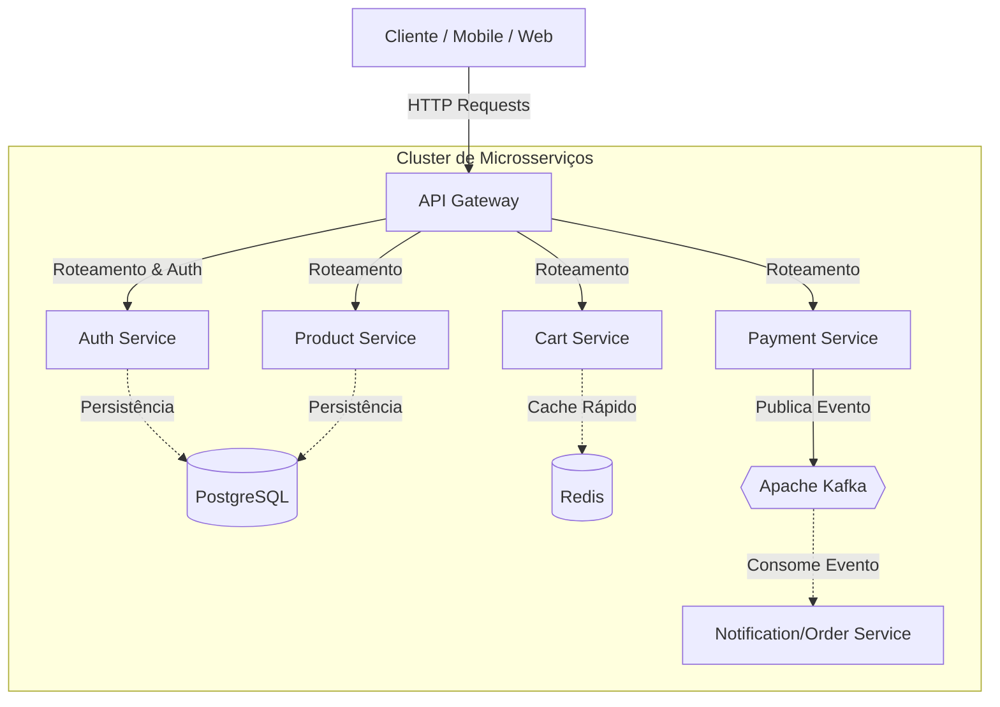

# 🛒 E-commerce Microservices System


Sistema robusto de microsserviços para e-commerce, desenvolvido com foco em escalabilidade, segurança e alta performance. O projeto orquestra serviços independentes para gestão de catálogo, autenticação segura, carrinho de compras de alta velocidade e processamento assíncrono de pagamentos.

---

## 🏗️ Arquitetura e Design

O sistema utiliza uma arquitetura baseada em microsserviços orquestrados por containers, seguindo o padrão MVC internamente em cada serviço. A comunicação ocorre via APIs REST (síncrona) utilizando **Feign Client** e via mensageria (assíncrona) com **Apache Kafka**.

### Diagrama de Arquitetura

### 🚀 Tecnologias e Ferramentas

• Core: Java 17, Spring Boot 3.5.7

• Arquitetura: Microservices, MVC, API Gateway

• Banco de Dados: * PostgreSQL: Para dados relacionais (Usuários, Produtos).

• Redis: Para dados voláteis e de acesso rápido (Carrinho de Compras).

• Mensageria: Apache Kafka (Processamento de eventos de pagamento).

• Segurança: Spring Security, OAuth2, JWT (JSON Web Token).

• Comunicação: Spring Cloud OpenFeign, Spring WebFlux.

• DevOps: Docker, Docker Compose.

• Utilitários: Lombok, MapStruct, Bean Validation, JPA.


### 🛠️ Instalação e Execução
Este projeto foi desenhado para rodar inteiramente via Docker, facilitando o setup do ambiente.

1. Pré-requisitos
Docker e Docker Compose instalados na máquina.

2. Configuração de Variáveis de Ambiente (.env)
Na raiz do projeto (onde está o docker-compose.yml), crie um arquivo chamado .env e preencha com suas credenciais:

#### --- Banco de Dados (PostgreSQL) ---

```

postgres_user=usuario_banco
postgres_password=sua_senha
postgres_database=seu_banco

```

#### --- Credenciais da Aplicação Spring ---
```

spring_user=user_app
spring_password=senha_app

```

#### --- Segurança (JWT) ---

Gere uma chave segura (ex: base64)

```

JWT_SECRET=sua_chave_secreta_jwt

```

3. Rodando a Aplicação
Execute o comando abaixo para compilar os projetos Java, construir as imagens Docker e subir todos os containers:

```

docker compose up --build

```
